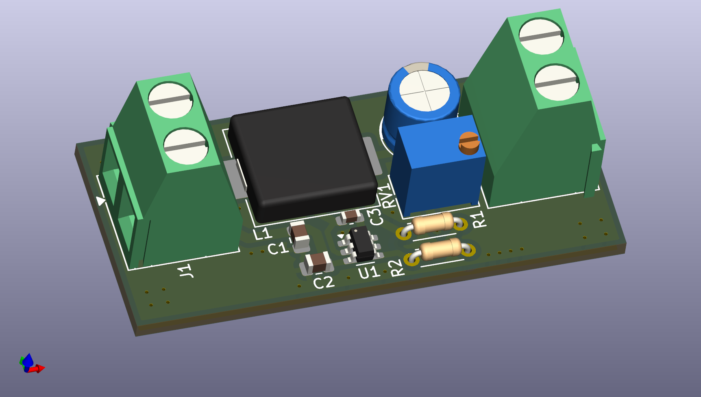
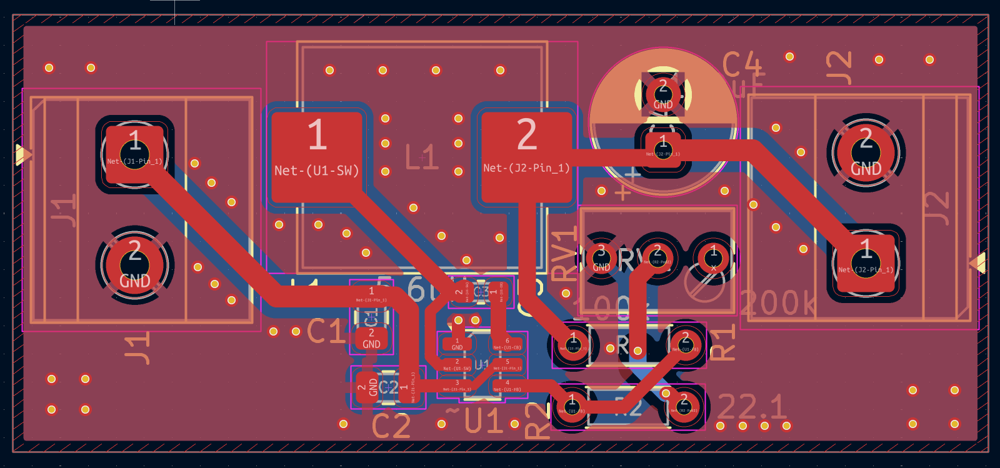

This repository contains the design and development of a buck (step-down) DC-DC converter, focused on evaluating different controller ICs and design approaches to achieve the same functional goal.

## Hardware Design

### Buck Converter

### PCB Layout

